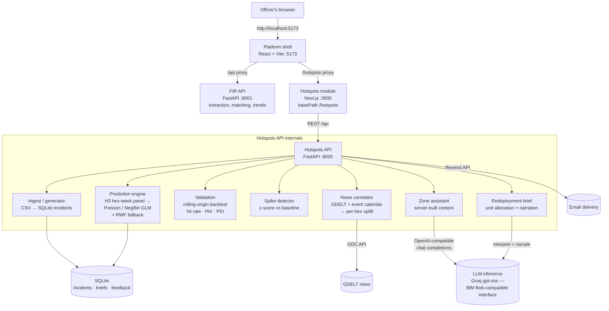

# Architecture

Netra is a small monorepo: a platform shell (sign-in + modules) and the Hotspots module
(this hackathon's core), each with its own FastAPI service, joined on one origin by the
shell's dev proxy.

## System diagram

## Components

| Component | Technology | Responsibility |
|---|---|---|
| Platform shell | React 19 + Vite, React Router, Radix, Recharts, Leaflet | Sign-in, navbar modules (Overview, FIR, Drug Risk, Hotspots, Settings), FIR intelligence UI |
| FIR API | FastAPI (`src/portal/backend`) | FIR extraction, repeat-offender matching, station trends, roles/JWT |
| Hotspots frontend | Next.js 14, deck.gl + MapLibre, TanStack Query | Risk map, zone dashboard, accuracy page, SHO brief, zone chat UI |
| Hotspots API | FastAPI (`src/backend`) | Everything below |
| Ingest | pandas, SQLModel | Seeded CSV/generator → normalized `incidents` table (H3-binned, tz-aware) |
| Prediction engine | statsmodels GLM, NumPy, H3 | Leakage-free hex-week panel; Poisson→NegBin under overdispersion; per-driver contributions; RWF fallback |
| Validation | pandas | Rolling-origin backtest; hit rate, PAI, PEI vs random + persistence |
| Spike detector | SciPy | Per-hex, per-crime z-score spikes, labelled seasonal / event-linked / emerging |
| News correlator | httpx, GDELT DOC API | Geo-matched news/events → bounded post-model λ̂ uplift (offline calendar fallback) |
| Redeployment brief | deterministic allocator + LLM narration | Unit split across top zones (risk-proportional, officer pins respected); Approve/Modify/Reject recorded |
| Zone assistant | OpenAI-compatible chat completions | Answers questions grounded **only** in the zone's page data |
| Persistence | SQLite via SQLModel | `incidents`, `briefs`, `feedback` |

## Data flow, end to end

1. **Ingest** — the seeded generator (or `src/data/csv`) produces ~6 months of incidents; each is
   H3-binned (res 8) and stored in SQLite.
2. **Predict** — on request, the engine builds the hex-week panel (features computed strictly
   from data before each week — the KDE surface is refit per week to avoid leakage), fits the
   GLM, and emits per-zone `probability`, `expected_count`, `risk_score`, and ranked drivers.
   News uplift multiplies λ̂ post-model, and the result is cached.
3. **Serve** — the map, zone dashboard, spikes, and accuracy pages read `/predict`, `/zones/{h3}`,
   `/spikes`, `/validation`.
4. **Assist** — the zone chat builds the grounding context **server-side** from the hex id, screens
   the user turn with a prompt-injection classifier, calls the LLM with a canary-carrying system
   prompt, and post-checks the reply for leaks before returning it.
5. **Act** — the brief allocator splits available units across the top zones; the officer reshapes
   it in plain language (LLM interprets → deterministic re-allocation → LLM narrates) and records
   Approve/Modify/Reject. Optionally the brief is emailed via Resend.

## Security & ethics notes

- **Human-in-the-loop by design:** nothing is dispatched automatically; every flag and plan is
  advisory and recorded with the officer's decision.
- **No personal data in the model:** features are place/time/crime-type only — no individuals,
  no demographics (see `ETHICS.md`).
- **LLM hardening:** server-built context, client can only send chat turns; injection pre-filter;
  prompt-leak canary; token/length budgets; per-client rate limits; keys live server-side in
  `.env` (never shipped to the browser; `.env` is git-ignored).
- **Dev topology:** the single-origin join is a dev-server proxy; production would put a real
  reverse proxy and auth in front.

## Scalability notes

- Predictions and the backtest are cached per dataset state; the GLM refit is seconds at
  station scale (~100 hexes). District/state scale is a matter of sharding by jurisdiction —
  the panel builder and H3 binning are embarrassingly parallel across stations.
- SQLite is deliberate for a self-contained demo; the storage layer is SQLModel/SQLAlchemy,
  so pointing it at PostgreSQL is a connection-string change.
